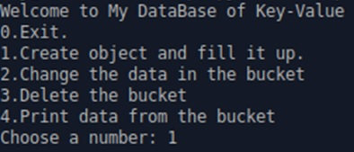
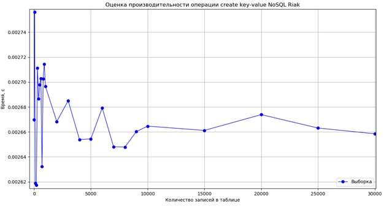
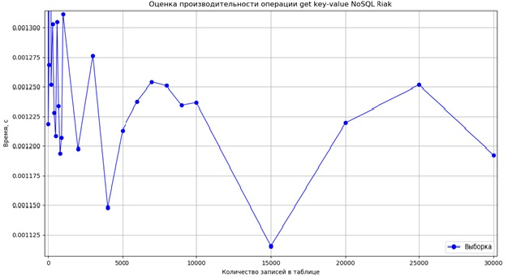
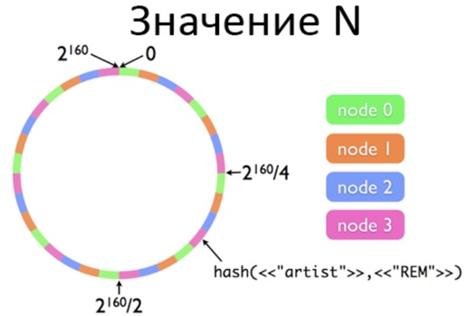
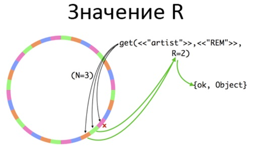
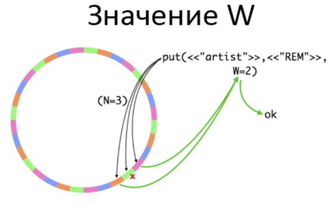

# Riak-Key-Value-DataBase

For NoSQL Riak DB, select queries have been implemented using Python 3.7 to create, modify, delete and dump data from the database.

When writing data (key-value) to Riak, a SHA-1 hash is taken from the key, and based on the hash, the data is written to several nodes at once. Since the nodes are distributed in a circle between the machines, the data goes to several different physical machines (Figure 10). The number of nodes to which data is written is called N.

Riak keeps a table of distribution of hash intervals by nodes, and knows where what data is located. By default, Riak attempts to read data from all three nodes, but when configuring, another parameter R is specified. It determines how many nodes the data must be successfully read from so that it can be sent to the client.

There is also the W parameter. It determines how many nodes you need to successfully write data so that you can answer the client that everything is fine.

The three parameters N, W, and R determine the balance between reliability and cluster speed.
